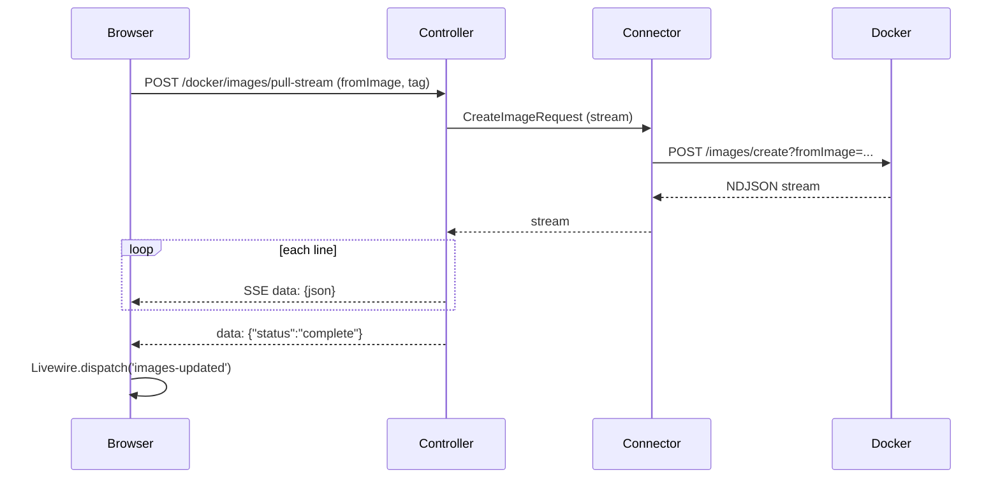

# Streaming

## Image pull (SSE)

Pulling an image in the UI uses Server-Sent Events so the browser can show progress without polling.

- The **ImagePullStreamController** validates input, builds a connector with `timeout => 0`, and sends `CreateImageRequest`. It reads the response body line-by-line (NDJSON), sends each line as an SSE `data:` event, then sends a final `{"status":"complete"}`. On error it sends one SSE event with `error`.
- The UI uses `fetch()` with the request body, then reads the response stream and parses SSE to update progress and status. Cancel uses `AbortController`.

## Container logs

Container logs use Docker’s multiplexed stream format (8-byte header: 1 byte stream type, 3 padding, 4 bytes size). The **StreamDecoder** in `src/Support/StreamDecoder.php` decodes frames into stdout/stderr. The UI or your code can use this to display logs correctly.
