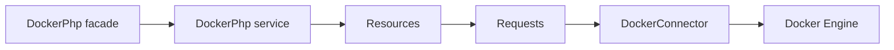

# API reference

The package uses [Saloon](https://saloon.dev) for HTTP: a **connector** sends **requests** and returns **responses**. Responses can be turned into **DTOs** when the request defines `createDtoFromResponse`. Errors are thrown as **DockerApiException**.



- [Connector](connector.md) — Connection modes, timeouts, TLS, error handling
- [Resources](resources.md) — All 17 resources and their methods
- [Requests](requests.md) — Request classes by category (100+ endpoints)
- [DTOs](dtos.md) — Data Transfer Objects for typed responses
- [Exceptions](exceptions.md) — DockerApiException and AlwaysThrowOnErrors

## Quick example

```php
use Eloquage\DockerPhp\Facades\DockerPhp;

$response = DockerPhp::containers()->list(all: true);
$containers = $response->json();

$response = DockerPhp::images()->list();
$summaries = $response->dto(); // ImageSummary[]

$response = DockerPhp::system()->info();
$info = $response->dto(); // SystemInfo
```
