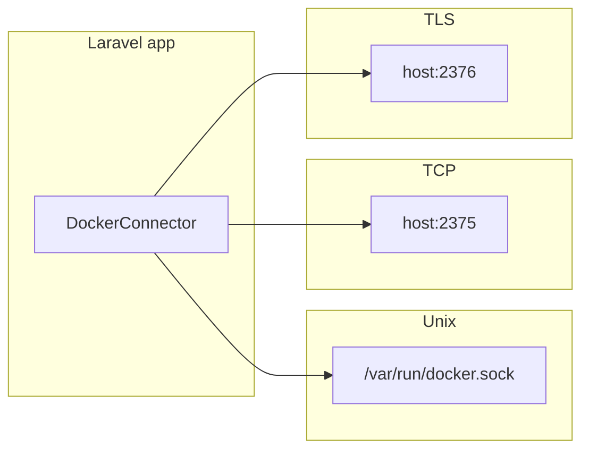

# Configuration

All options are defined in `config/docker-php.php` and can be overridden with environment variables.

## Config reference

| Config key | Env variable | Default | Description |
|------------|---------------|---------|-------------|
| `connection` | `DOCKER_CONNECTION` | `unix` | One of `unix`, `tcp`, `tls`. |
| `unix_socket` | `DOCKER_UNIX_SOCKET` | `'/var/run/docker.sock'` | Socket path when `connection` is `unix`. |
| `host` | `DOCKER_HOST` | `'localhost'` | Host for `tcp` or `tls`. |
| `port` | `DOCKER_PORT` | `2375` | Port for `tcp` or `tls`. |
| `version` | `DOCKER_API_VERSION` | `'v1.53'` | Docker Engine API version. |
| `tls_cert` | `DOCKER_TLS_CERT` | `null` | Path to client certificate (TLS). |
| `tls_key` | `DOCKER_TLS_KEY` | `null` | Path to client key (TLS). |
| `tls_ca` | `DOCKER_TLS_CA` | `null` | Path to CA certificate (TLS). |
| `tls_verify` | `DOCKER_TLS_VERIFY` | `true` | Verify TLS peer (TLS). |
| `connect_timeout` | `DOCKER_CONNECT_TIMEOUT` | `10` | Connection timeout in seconds. |
| `timeout` | `DOCKER_TIMEOUT` | `30` | Request timeout in seconds. |
| `headers` | — | `['User-Agent' => 'Docker-PHP-Client/1.0']` | Default request headers. `DOCKER_USER_AGENT` overrides User-Agent. |
| `cache.enabled` | `DOCKER_PHP_CACHE_ENABLED` | `true` | Enable Saloon cache for read-only requests. |
| `cache.store` | `DOCKER_PHP_CACHE_STORE` | `null` | Laravel cache store name; `null` uses default. |
| `ui.enabled` | `DOCKER_PHP_UI_ENABLED` | `true` | Register UI routes and Livewire components. |
| `ui.prefix` | `DOCKER_PHP_UI_PREFIX` | `'docker'` | URL prefix for UI routes (e.g. `/docker`). |
| `ui.middleware` | — | `['web']` | Middleware applied to UI routes (e.g. add `auth`). |

## Connection types

- **Unix:** Uses `CURLOPT_UNIX_SOCKET_PATH`. No network port; ideal for local daemon.
- **TCP:** Plain HTTP to `host:port`. Use only in trusted networks or with a reverse proxy.
- **TLS:** HTTPS with client certificates. Set `tls_cert`, `tls_key`, `tls_ca`; use `tls_verify: true` in production.

## Cache

When `cache.enabled` is `true`, the following requests use Laravel’s cache (or the configured store):

- **InfoRequest** — 60 seconds
- **VersionRequest** — 300 seconds
- **InspectImageRequest** — 120 seconds
- **ImageHistoryRequest** — 120 seconds

Container list, image list, logs, stats, and events are not cached. See [Caching](advanced/caching.md).

## UI

- **Prefix:** All UI routes are under `/{prefix}` (e.g. `/docker`).
- **Middleware:** Default is `['web']`. Add `'auth'` to require login.
- **Disable UI:** Set `ui.enabled` to `false` if you only use the API.
