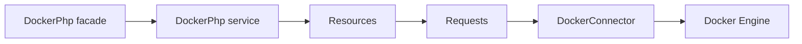

# Docker PHP

[![PHP 8.4][ico-php]][link-php]
[![Laravel 12][ico-laravel]][link-laravel]
[![Tests][ico-tests]][link-tests]
[![License][ico-license]][link-license]
[![Packagist][ico-packagist]][link-packagist]
[![Downloads][ico-downloads]][link-downloads]

**A comprehensive Docker Engine API client for Laravel with a built-in Livewire management UI.**

Connect to your Docker daemon via Unix socket, TCP, or TLS. Use the fluent API in code or the included UI to manage containers, images, networks, volumes, and Swarm.

---

## Features

| **Full API coverage** | 100+ Docker Engine API v1.53 endpoints: containers, images, networks, volumes, swarm, services, nodes, tasks, secrets, configs, plugins, build, exec, distribution. |
| **Livewire UI** | 15 management components with Flux UI styling and dark mode: dashboard, containers, images, networks, volumes, swarm, services, nodes, tasks, secrets, configs, plugins. |
| **Real-time streaming** | Image pull progress via Server-Sent Events; container logs and stats; multiplexed stream decoding. |
| **Type-safe DTOs** | Data Transfer Objects for list and inspect responses: `ImageSummary`, `ContainerSummary`, `SystemInfo`, `DiskUsage`, and more. |
| **Selective caching** | Saloon cache plugin for read-only requests (info, version, image inspect/history) with configurable TTLs. |
| **Connection flexibility** | Unix socket (default), TCP, or TLS with certificate support. Configurable timeouts and headers. |
| **Docker Swarm** | Initialize, join, leave; manage services, nodes, tasks, secrets, and configs from the UI or API. |
| **Architecture tested** | Lawman expectations for Saloon connector and requests; Pest for feature and unit tests. |

---

## Quick start

**1. Install**

```bash
composer require eloquage/docker-php
```

**2. Publish config**

```bash
php artisan vendor:publish --tag=docker-php.config
```

**3. Configure** (default: Unix socket)

```env
DOCKER_CONNECTION=unix
DOCKER_UNIX_SOCKET=/var/run/docker.sock
DOCKER_API_VERSION=v1.53
```

**4. Open the UI** at `/docker` (or your configured prefix).

---

## Programmatic usage

```php
use Eloquage\DockerPhp\Facades\DockerPhp;

// List containers
$response = DockerPhp::containers()->list(all: true);
$containers = $response->json();

// List images (returns DTOs)
$response = DockerPhp::images()->list();
$images = $response->dto(); // ImageSummary[]

// System info
$response = DockerPhp::system()->info();
$info = $response->dto(); // SystemInfo
$hostname = $info->name();
```

Errors are thrown as `Eloquage\DockerPhp\Exceptions\DockerApiException` with the daemon’s message.

---

## Configuration overview

| Env / config | Default | Description |
|--------------|---------|-------------|
| `DOCKER_CONNECTION` | `unix` | `unix`, `tcp`, or `tls` |
| `DOCKER_UNIX_SOCKET` | `/var/run/docker.sock` | Socket path (unix) |
| `DOCKER_HOST` | `localhost` | Host (tcp/tls) |
| `DOCKER_PORT` | `2375` | Port (tcp/tls) |
| `DOCKER_API_VERSION` | `v1.53` | Engine API version |
| `DOCKER_PHP_UI_PREFIX` | `docker` | URL prefix for the UI |
| `DOCKER_PHP_CACHE_ENABLED` | `true` | Cache for read-only requests |

See `config/docker-php.php` and the [documentation](https://eloquage.github.io/docker-php) for the full reference.

---

## UI preview

The UI includes a sidebar with **Dashboard**, **Containers**, **Images**, **Volumes**, **Networks**, and (when Swarm is initialized) **Swarm**, **Services**, **Nodes**, **Tasks**, **Secrets**, and **Configs**. The dashboard loads system info, version, and disk usage in parallel. Images support pull with progress bar (SSE), Docker Hub search, tag, inspect with history, and prune with feedback.

---

## Testing

```bash
vendor/bin/pest --compact
```

Tests use Saloon’s MockClient; no Docker daemon is required. See [Testing](docs/advanced/testing.md) in the docs.

---

## Architecture



Livewire components use the same `DockerPhp` service and resources to drive the UI.

---

## Documentation

Full documentation (getting started, configuration, API reference, UI guide, caching, streaming, testing) is published at:

**[https://eloquage.github.io/docker-php](https://eloquage.github.io/docker-php)**

---

## Changelog

See [changelog.md](changelog.md) for what has changed recently.

## Contributing

See [contributing.md](contributing.md) for details.

## Security

If you discover any security-related issues, please email the maintainers instead of using the issue tracker.

## License

MIT. See the [license file](license.md) for more information.

---

[ico-php]: https://img.shields.io/badge/PHP-8.4-777BB4?style=flat-square&logo=php
[ico-laravel]: https://img.shields.io/badge/Laravel-12-FF2D20?style=flat-square&logo=laravel
[ico-tests]: https://github.com/eloquage/docker-php/actions/workflows/tests.yml/badge.svg?style=flat-square
[ico-license]: https://img.shields.io/packagist/l/eloquage/docker-php?style=flat-square
[ico-packagist]: https://img.shields.io/packagist/v/eloquage/docker-php?style=flat-square
[ico-downloads]: https://img.shields.io/packagist/dt/eloquage/docker-php?style=flat-square

[link-php]: https://www.php.net/
[link-laravel]: https://laravel.com
[link-tests]: https://github.com/eloquage/docker-php/actions/workflows/tests.yml
[link-license]: license.md
[link-packagist]: https://packagist.org/packages/eloquage/docker-php
[link-downloads]: https://packagist.org/packages/eloquage/docker-php
